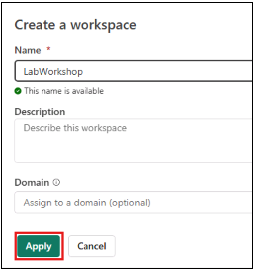
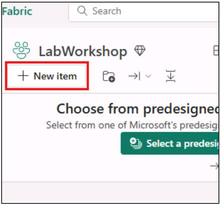
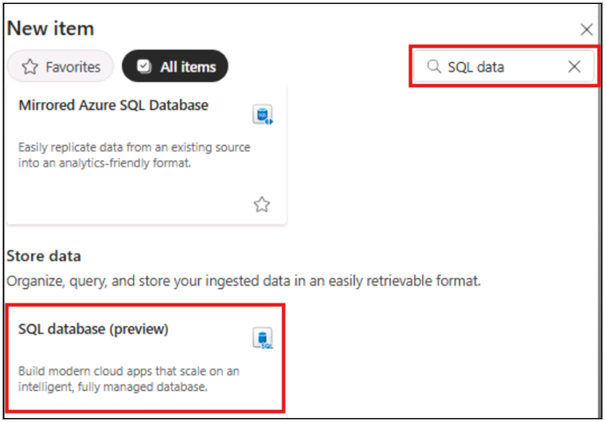
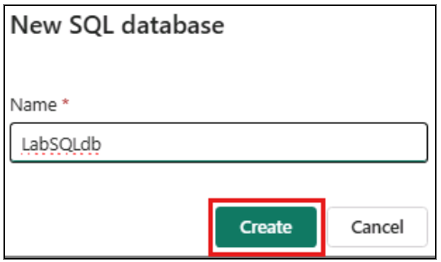
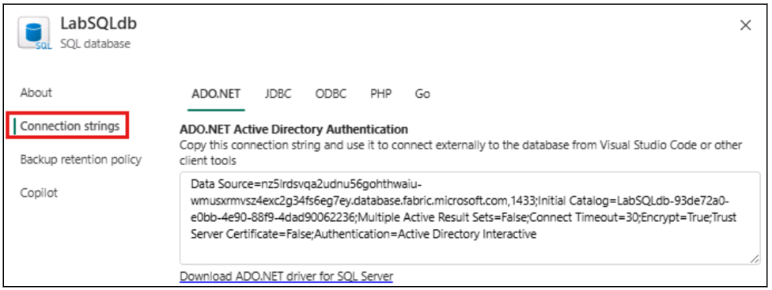
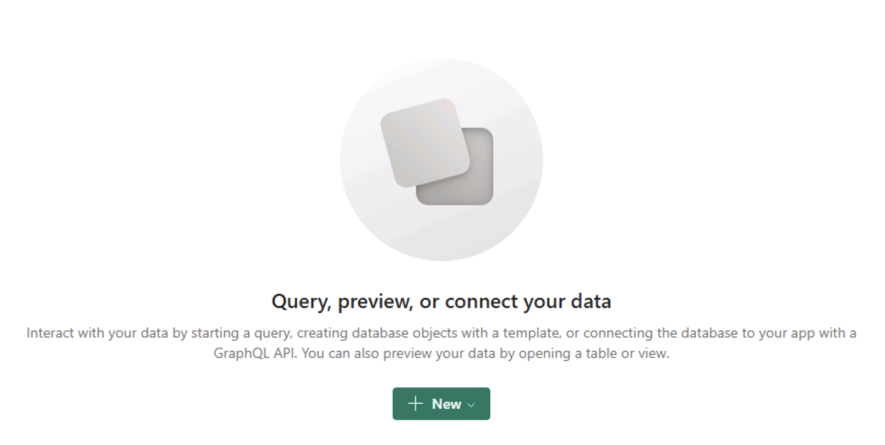
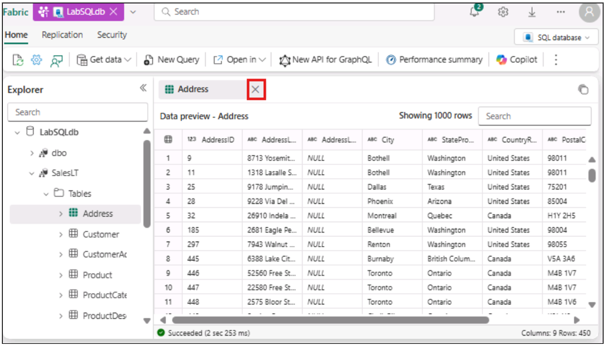
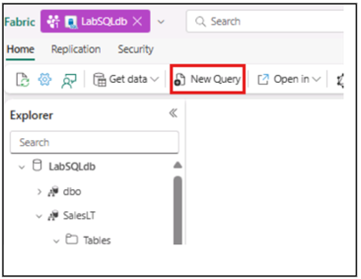
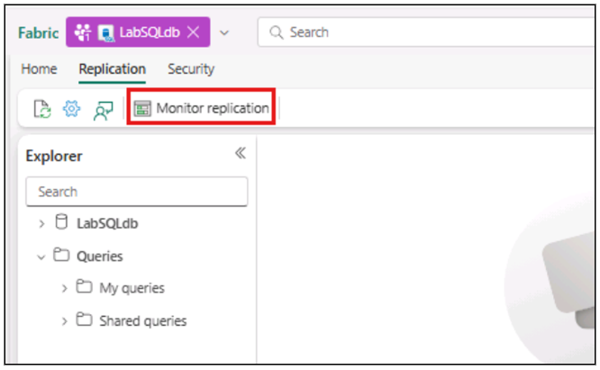
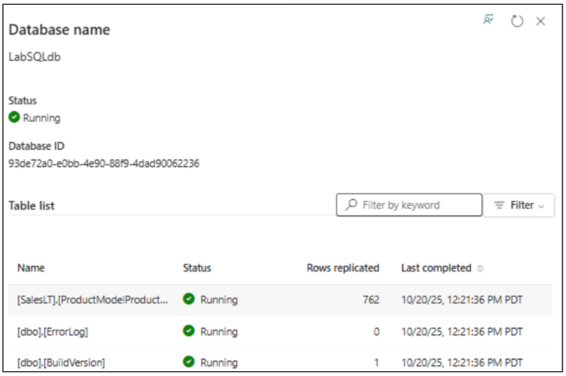

In this Lab, you’ll get hands‑on with the SQL database in Microsoft Fabric. We'll begin by setting up a Fabric SQL database and loading sample data followed by trying out the Copilot-assisted querying (including NL2SQL). From there, you'll learn how to expose your data through APIs, connect seamlessly to applications, analytics and Power BI, and explore building Retrieval-Augmented Generation (RAG) application using SQL database in Microsoft Fabric.

 The focus of this lab is to understand how to design, build, and operationalize end-to-end AI-ready applications using SQL database in Fabric as the core data backbone.

# SQL database in Microsoft Fabric

**SQL database** in Microsoft Fabric provides a familiar, fully managed SQL environment within the Fabric ecosystem. It combines the scalability and performance of cloud-native databases with deep integration into Fabric’s analytics and data experiences. Developers, analysts, and business users can all leverage SQL syntax to query, transform, and analyze data alongside other Fabric workloads. 

### Key benefits of using SQL database in Fabric:
- Fully managed – no need to handle infrastructure, backups, or scaling.
- Secure and governed by Fabric’s centralized workspace and role-based access control.
- Fast time-to-value – quickly create, load, and query data for analytics and reporting with native integration with Fabric’s platform (Data Engineering, Data Science, Power BI)
- Set up for analytics by automatically replicating the data into OneLake in near real-time.
- Familiar SQL experience, lowering the barrier for anyone with prior SQL Server or T-SQL knowledge.


## Section 1: Getting started

In this section of the lab, we will be logging into the Microsoft Fabric Portal and create a new Fabric Workspace.

### Task 1.1: Login 

Using a web browser of your choice, please navigate to this `https://app.fabric.microsoft.com/home`.

1. Enter your AAD Username `@lab.CloudPortalCredential(User1).Username` in the Email field, then click on the Submit button.

2. Enter your password `@lab.CloudPortalCredential(User1).Password` and click on the Sign in button. 

3. If prompted with "Stay signed in?" select "Yes" and proceed.

4. If popup "Welcome to the Fabric view" is showed, feel free to close it by selecting 'X' on the top right corner and proceed with the lab content.
![IMPORTANT]
Known issue: If you get prompted to create an account with job title or business phone number, please reload the page with the URL `https://app.fabric.microsoft.com/home` 

### Task 1.2: Create the Microsoft Fabric Workspace

1. Click a **New Workspace tile** on the  mid-left side of the screen. 

   
2. Enter a unique Name and hit apply
 
    

## Section 2: Creating a SQL database in Microsoft Fabric
In this section you will create a SQL database and load it with data.

### Task 2.1: Create the SQL database in Microsoft Fabric

1. On the Microsoft Fabric Workspace page, click the **New item** button on the top left of the page.



2. In the **New item** blade on the right, use the **Filter by item type search box** to search for **SQL** and select **SQL database ** tile


> [!IMPORTANT]
> There may be a few seconds delay after pressing the **SQL database tile** and when the **New SQL database dialog** appears.  

3. In the **New SQL database** dialog window, Use a unique name for the database and click the **green Create button**.



4. Once the database is finished creating, you will be taken to SQL database's home page.

### Task 2.2: Loading the database with sample data

1. You need some sample data in the database to work with. Click the **Sample data** tile right on the database home page to load sample data.


2. In the upper right corner of the database home page, you will see a notification indicating that the data is being loaded into the database.


Allow this process to run (about 45-90 seconds) until you see a notification indicating that the data was successfully loaded into the database appearing again, in the upper right corner.


While we're waiting for the data to be loaded, let's explore SQL database editor experience.


3. You can open settings database by clicking on the Gears icon and explore different configurations available here, and also find the connection strings for your app.


4. Now click on X in top right corner to close the settings blade and continue observing the ways to insert data and create new T-SQL queries either blank or through templates.


5. Next one provides a smooth way to connect directly to your database through the connection wizard from the tool of your choice (SSMS or VSCode) - first click on ** Open in ** dropdown and then choose the tool. You won't be connecting to the database just yet, so close the settings blade for now by clicking on 'X'.


6. Last three options in the toolbar are used for creating new GraphQL API for your Fabric SQL database, opening database performance dashboard in Fabric portal and Copilot on the right side. We'll explore these later during the lab in more details.

    
7. The sample data has finished loading now and you can observe that by notification in the top right corner and the middle of home page will change to a **Query, preview, or connect your data**.



## Section 3: Working with the SQL database in Microsoft Fabric

In this next section, you will be focused on using the Web Editor for SQL database in Microsoft Fabric.

### Task 3.1: Getting familiar with Database Explorer and Query editor

1. To start, look at the **Database Explorer** area on the left of the page. Here, click the dropdown arrow next to the database to see a list of database schemas. Expand the **SalesLT** schema to see the objects inside it.


2. Expand the **SalesLT** schema, followed by expanding the **Tables** folder. Then click on the **Address** table.



3. After browsing the data in the Address table, **close** the Data preview by clicking on the **X** next to the **Address Data preview tab**.

4. Now, click the **New Query** button on the tool bar


this will open a new query editor window that we will use to work directly with the database. 


5. Copy and paste the following code into the query editor:

    ```
    select top 100 * from [SalesLT].[Product]
    ```

6. Once the code is in the query editor, **click the Run button** (or you can use `CTRL + Enter` as a shortcut).


You will see the **results** of the query on the **bottom of the query editor**.


Notice there are 100 records in this table.

With the data from your SQL database automatically mirrored in OneLake, you can write cross-database queries, joining data from other SQL databases, mirrored databases, warehouses, and lakehouses. All this is currently possible with using T-SQL queries on the SQL analytics endpoint - a SQL-based experience to analyze OneLake data. Creating a SQL database in Fabric automatically creates a SQL analytics endpoint, which points to the rad-only replicated SQL database in Fabric OneLake storage.
[!IMPORTANT]
Note: Please refresh the ** browser ** with ctrl + F5 before you move to next step. 

1. To access SQL analytics endpoint, switch to SQL analytics endpoint mode in the top right corner.   


2. In SQL analytics endpoint select a **New SQL query** 

Copy the below code and paste it in the SQL query. 
    
    ```
    SELECT TOP 100 * FROM [SalesLT].[Product]
    ORDER BY [ProductID] DESC;
    ```
Click Run button to see the results. Notice that there are 100 records in this table. 

3. To get back to SQL database select "SQL database" option from the top right dropdown.

 
4. Database replication to onelake can be monitored from the replication status of your database. Click _Replication_ tab on top left corner and select _Monitor replication_.



8. This will open up a blade on the right side that demonstrates the status and the last mirroring refresh time.

 
With this, we're wrapping up the hands-on part for this module. 
With SQL analytics endpoint you can join your data from different items using a three-part naming convention. This way you can join data from other mirrored databases or warehouses. 


## What's next
Congratulations! You have learnt the basics of SQL database in Microsoft Fabric. You are now ready to move on to the next exercise:
Use Copilot with SQL database in Fabric

