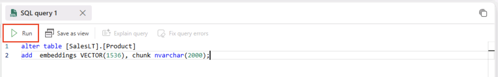
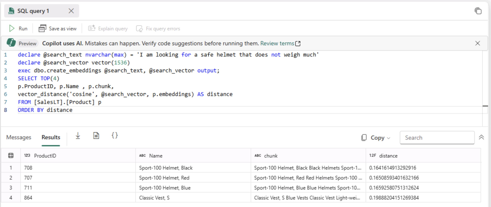
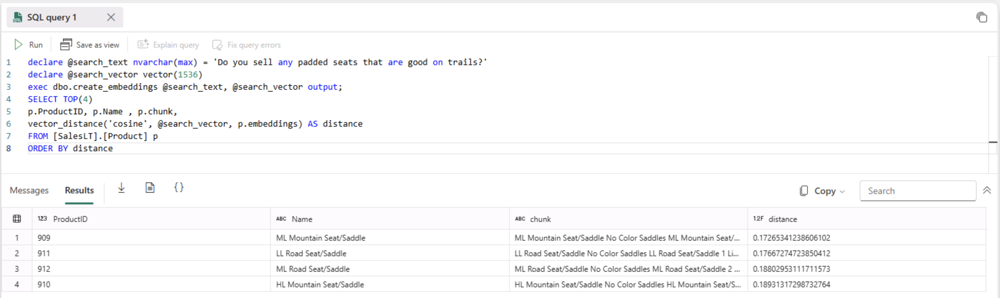

# Build an AI Application using RAG with SQL Database in Fabric​

This lab walks through building a Retrieval-Augmented Generation (RAG) application using SQL Database in fabric, and Azure OpenAI. 
You'll learn how to generate and store vector embeddings for relational data, perform semantic similarity searches using SQL's VECTOR_DISTANCE function, and expose the results via a GraphQL API.
The final step integrates Azure OpenAI Chat Completion to deliver natural language responses, enabling intelligent product recommendations. The demo concludes with a Power BI report powered by Copilot for visualizing SQL data.

# Setup of database credential

A database scoped credential is a record in the database that contains authentication information for connecting to a resource outside the database. For this lab, we will be creating one that contains the api key for connecting to Azure OpenAI services.
<!---
> **Note:** During this lab, the OpenAI API key and API name will be provided. If you need assistance accessing these details, please reach out to the proctor. ``AI_ENDPOINT_SERVERNAME`` with the name of your **Azure OpenAI** service and ``<api-key>`` with the **API key** for the Azure OpenAI API.
`+++@lab.CloudResourceTemplate(Lab533Resources).Outputs[openAIEndpoint]+++`
--->

Connect to the database and click New SQL Query - Copy the code below and hit run.

```SQL-notype

if not exists(select * from sys.symmetric_keys where [name] = '##MS_DatabaseMasterKey##')
begin
    create master key encryption by password = N'V3RYStr0NGP@ssw0rd!';
end
go
if exists(select * from sys.[database_scoped_credentials] where name = 
'@lab.CloudResourceTemplate(Lab533Resources).Outputs[openAIEndpoint]')
begin
	drop database scoped credential [@lab.CloudResourceTemplate(Lab533Resources).Outputs[openAIEndpoint]];
end
create database scoped credential [@lab.CloudResourceTemplate(Lab533Resources).Outputs[openAIEndpoint]]
with identity = 'HTTPEndpointHeaders', secret = '{"api-key": "@lab.CloudResourceTemplate(Lab533Resources).Outputs[openAIPrimaryKey]"}';
go

 ```
# 1. Creating embeddings for relational data

## Understanding embeddings in Azure OpenAI

An embedding is a special format of data representation that machine learning models and algorithms can easily use. The embedding is an information dense representation of the semantic meaning of a piece of text. Each embedding is a vector of floating-point numbers. Vector embeddings can help with semantic search by capturing the semantic similarity between terms. For example, "cat" and "kitty" have similar meanings, even though they are spelled differently. 

Embeddings created and stored in the Azure SQL Database in Microsoft Fabric during this lab will power a vector similarity search in a chat app you will build.

## The Azure OpenAI embeddings endpoint

1. Using an empty query sheet in Microsoft Fabric, copy and paste the following code. This code calls an Azure OpenAI embeddings endpoint. The result will be a JSON array of vectors.

<!--- > **Note:** Replace ``AI_ENDPOINT_SERVERNAME`` with the name of your **Azure OpenAI** service. --->

```SQL-notype

    DECLARE @url nvarchar(4000) = '@lab.CloudResourceTemplate(Lab533Resources).Outputs[openAIEndpoint]openai/deployments/text-embedding-ada-002/embeddings?api-version=2024-06-01';
    DECLARE @message nvarchar(max) = 'Hello World!';
    DECLARE @payload nvarchar(max) = N'{"input": "' + @message + '"}';

    DECLARE @ret int, @response nvarchar(max);

    exec @ret = sp_invoke_external_rest_endpoint 
        @url = @url,
        @method = 'POST',
        @payload = @payload,
        @credential = [@lab.CloudResourceTemplate(Lab533Resources).Outputs[openAIEndpoint]],
        @timeout = 230,
        @response = @response output;

    select json_query(@response, '$.result.data[0].embedding') as "JSON Vector Array";

```

1. Again, click the run button on the query sheet. The result will be a JSON vector array.
    
    

    Using the built in JSON function json_query, we are able to extract JSON array from REST response payloads. In the above T-SQL, **json_query(@response, '$.result.data[0].embedding') as "JSON Vector Array"** will extract the vector array from the result payload returned to us from the Azure OpenAI REST endpoint. 
    
    For reference, the JSON response message from the Azure OpenAI embeddings endpoint will look similar to the following and, you can see how we extract the array found_**$.result.data[0].embedding**.

    > [!TIP]
    >
    > **This code is for reference only** 

    ```JSON-nocopy-notype
    {
        "response": {
            "status": {
                "http": {
                    "code": 200,
                    "description": ""
                }
            },
            "headers": {
                "Date": "Thu, 24 Oct 2024 19:32:59 GMT",
                "Content-Length": "33542",
                "Content-Type": "application/json",
                "access-control-allow-origin": "*",
                "apim-request-id": "ac67032f-41c1-4ec3-acc6-3f697c262764",
                "strict-transport-security": "max-age=31536000; includeSubDomains; preload",
                "x-content-type-options": "nosniff",
                "x-ms-region": "West US",
                "x-request-id": "84baf32d-f1f7-4183-9403-a95365d01a3e",
                "x-ms-client-request-id": "ac67032f-41c1-4ec3-acc6-3f697c262764",
                "x-ratelimit-remaining-requests": "349",
                "azureml-model-session": "d007-20240925154241",
                "x-ratelimit-remaining-tokens": "349994"
            }
        },
        "result": {
            "object": "list",
            "data": [
                {
                    "object": "embedding",
                    "index": 0,
                    "embedding": [
                        0.0023929428,
                        0.00034713413,
                        -0.0023142276,
                        -0.025654867,
                        -0.011492423,
                        0.0010358924,
                        -0.014836246,
                        0.0035484824,
                        0.000045630233,
                        -0.027581815,
                        0.023816079,
                        0.005012586,
                        -0.027732948,
                        -0.010088143,
                        ...
                        -0.014571763
                    ]
                }
            ],
            "model": "text-embedding-ada-002",
            "usage": {
                "prompt_tokens": 3,
                "total_tokens": 3
            }
        }
    }
    ```

    This JSON vector array can now be used with new vector datatype and functions in the SQL database in fabric such as VECTOR_DISTANCE. 

## Preparing the database and creating embeddings

This next section of the lab will have you alter the Adventure Works product table to add a new vector datatype column. You will then use a stored procedure to create embeddings for the products and store the vector arrays in that column.

1. In a new query sheet or an existing bank one in VS Code, copy and paste the following T-SQL:

    ```SQL-notype
    alter table [SalesLT].[Product]
    add  embeddings VECTOR(1536), chunk nvarchar(2000);
    ```

    This code adds a vector datatype column to the Product table. It also adds a column named chunk where we will store the text we send over to the embeddings REST endpoint.

1. Then click the run button on the query sheet
    

1. Next, you are going to use the External REST Endpoint Invocation procedure (sp_invoke_external_rest_endpoint) to create a stored procedure that will create embeddings for text we supply as an input. Copy and paste the following code into a blank query editor in Microsoft Fabric:

<!--- > **Note:** Replace ``AI_ENDPOINT_SERVERNAME`` with the name of your **Azure OpenAI** service. --->
 
 ```SQL-notype

    create or alter procedure dbo.create_embeddings
    (
        @input_text nvarchar(max),
        @embedding vector(1536) output
    )
    AS
    BEGIN
    DECLARE @url varchar(max) = '@lab.CloudResourceTemplate(Lab533Resources).Outputs[openAIEndpoint]openai/deployments/text-embedding-ada-002/embeddings?api-version=2024-06-01';
    DECLARE @payload nvarchar(max) = json_object('input': @input_text);
    DECLARE @response nvarchar(max);
    DECLARE @retval int;

    -- Call to Azure OpenAI to get the embedding of the search text
    begin try
        exec @retval = sp_invoke_external_rest_endpoint
            @url = @url,
            @method = 'POST',
            @credential = [@lab.CloudResourceTemplate(Lab533Resources).Outputs[openAIEndpoint]],
            @payload = @payload,
            @response = @response output;
    end try
    begin catch
        select 
            'SQL' as error_source, 
            error_number() as error_code,
            error_message() as error_message
        return;
    end catch
    if (@retval != 0) begin
        select 
            'OPENAI' as error_source, 
            json_value(@response, '$.result.error.code') as error_code,
            json_value(@response, '$.result.error.message') as error_message,
            @response as error_response
        return;
    end
    -- Parse the embedding returned by Azure OpenAI
    DECLARE @json_embedding nvarchar(max) = json_query(@response, '$.result.data[0].embedding');

    -- Convert the JSON array to a vector and set return parameter
    set @embedding = CAST(@json_embedding AS VECTOR(1536));
    END;

```

1. Click the run button on the query sheet to create the procedure in the database.

1. You have our embeddings procedure, now use it with data from the various products table. This SQL code takes descriptive elements from each product and concatenating them into a single string to send to the embeddings endpoint. You can construct this text string with the following SQL:

    > [!TIP]
    >
    > **This code is for reference only** 
	
	```SQL-nocopy-notype
	SELECT p.Name + ' '+ ISNULL(p.Color,'No Color') + ' '+  c.Name + ' '+  m.Name + ' '+  ISNULL(d.Description,'')
	FROM 
		[SalesLT].[ProductCategory] c,
		[SalesLT].[ProductModel] m,
		[SalesLT].[Product] p
		LEFT OUTER JOIN
		[SalesLT].[vProductAndDescription] d
			on p.ProductID = d.ProductID
			and d.Culture = 'en'
	where p.ProductCategoryID = c.ProductCategoryID
	and p.ProductModelID = m.ProductModelID
	and p.ProductID = @ProductID
	```

    Looking_the SQL, the text we are embedding contains the product name, product color (if available), the category name the product belongs to, the model name of the product, and the description of the product.


1. Run the following T-SQL in a blank query editor in Microsoft Fabric to create embeddings for all products in the Products table:

    > [!IMPORTANT]
    >
    > **This code will take 30 to 60 seconds to run** 

    ```SQL-notype
    SET NOCOUNT ON
    DROP TABLE IF EXISTS #MYTEMP 
    DECLARE @ProductID int
    DECLARE @text nvarchar(max);
    DECLARE @vector vector(1536);
    SELECT * INTO #MYTEMP FROM [SalesLT].Product
    SELECT @ProductID = ProductID FROM #MYTEMP
    SELECT TOP(1) @ProductID = ProductID FROM #MYTEMP
    WHILE @@ROWCOUNT <> 0
    BEGIN
        set @text = (SELECT p.Name + ' '+ ISNULL(p.Color,'No Color') + ' '+  c.Name + ' '+  m.Name + ' '+  ISNULL(d.Description,'')
                        FROM 
                        [SalesLT].[ProductCategory] c,
                        [SalesLT].[ProductModel] m,
                        [SalesLT].[Product] p
                        LEFT OUTER JOIN
                        [SalesLT].[vProductAndDescription] d
                        on p.ProductID = d.ProductID
                        and d.Culture = 'en'
                        where p.ProductCategoryID = c.ProductCategoryID
                        and p.ProductModelID = m.ProductModelID
                        and p.ProductID = @ProductID);
        exec dbo.create_embeddings @text, @vector output;
        update [SalesLT].[Product] set [embeddings] = @vector, [chunk] = @text where ProductID = @ProductID;
        DELETE FROM #MYTEMP WHERE ProductID = @ProductID
        SELECT TOP(1) @ProductID = ProductID FROM #MYTEMP
    END
    ```

1. To ensure all the embeddings were created, run the following code in a blank query editor in Microsoft Fabric: 

    ```SQL-notype
    select count(*) from SalesLT.Product where embeddings is null;
    ```

    You should get 0 for the result.

1. Run the next query in a blank query editor in Microsoft Fabric to see the results of the above update to the Products table:

    ```SQL-notype
    select top 10 chunk, embeddings from SalesLT.Product
    ```

    You can see that the chunk column is the combination of multiple data points about a product and the embeddings column contains the vector arrays.

    

## Vector similarity searching

Vector similarity searching is a technique used to find and retrieve data points that are similar to a given query, based on their vector representations. The similarity between two vectors is usually measured using a distance metric, such as cosine similarity or Euclidean distance. These metrics quantify the similarity between two vectors by calculating the angle between them or the distance between their coordinates in the vector space.

Vector similarity searching has numerous applications, such as recommendation systems, search engines, image and video retrieval, and natural language processing tasks. It allows for efficient and accurate retrieval of similar items, enabling users to find relevant information or discover related items quickly and effectively.

The VECTOR_DISTANCE function is a new feature of the SQL Database in fabric that can calculate the distance between two vectors enabling similarity searching right in the database. 

The syntax is as follows:

```SQL-nocopy-notype
VECTOR_DISTANCE ( distance_metric, vector1, vector2 )
```

You will be using this function in some upcoming samples as well as in the RAG chat application; both utilizing the vectors you just created for the Products table.

1. The first query will pose the question "I am looking for a red bike and I dont want to spend a lot". The key words that should help with our similarity search are red, bike, and dont want to spend a lot. Run the following SQL in a blank query editor in Microsoft Fabric:

    ###### Query 1

    ```SQL-notype
    DECLARE @search_text nvarchar(max) = 'I am looking for a red bike and I dont want to spend a lot'
    DECLARE @search_vector vector(1536)
    exec dbo.create_embeddings @search_text, @search_vector output;
    SELECT TOP(4) 
    p.ProductID, p.Name , p.chunk,
    vector_distance('cosine', @search_vector, p.embeddings) AS distance
    FROM [SalesLT].[Product] p
    ORDER BY distance
    ```

    And you can see from the results, the search found exactly that, an affordable red bike. The distance column shows us how similar it found the results to be using VECTOR_DISTANCE, with a lower score being a better match.

    ###### Query 1 results

    | ProductID | Name | chunk | distance |
    |:---------|:---------|:---------|:---------|
    | 763 | Road-650 Red, 48 | Road-650 Red, 48 Red Road Bikes Road-650 Value-priced bike with many features of our top-of-the-line models. Has the same light, stiff frame, and the quick acceleration we're famous for. | 0.16352240013483477 |
    | 760 | Road-650 Red, 60 | Road-650 Red, 60 Red Road Bikes Road-650 Value-priced bike with many features of our top-of-the-line models. Has the same light, stiff frame, and the quick acceleration we're famous for. | 0.16361482158949225 |
    | 759 | Road-650 Red, 58 | Road-650 Red, 58 Red Road Bikes Road-650 Value-priced bike with many features of our top-of-the-line models. Has the same light, stiff frame, and the quick acceleration we're famous for. | 0.16432339626539993 |
    | 762 | Road-650 Red, 44 | Road-650 Red, 44 Red Road Bikes Road-650 Value-priced bike with many features of our top-of-the-line models. Has the same light, stiff frame, and the quick acceleration we're famous for. | 0.1652894865541471 |
    

1. The next search will be looking for a safe lightweight helmet. Run the following SQL in a blank query editor in Microsoft Fabric:

    ###### Query 2

    ```SQL-notype
    DECLARE @search_text nvarchar(max) = 'I am looking for a safe helmet that does not weigh much'
    DECLARE @search_vector vector(1536)
    exec dbo.create_embeddings @search_text, @search_vector output;
    SELECT TOP(4) 
    p.ProductID, p.Name , p.chunk,
    vector_distance('cosine', @search_vector, p.embeddings) AS distance
    FROM [SalesLT].[Product] p
    ORDER BY distance
    ```

    With the results returning lightweight helmets. There is one result that is not a helmet but a vest but as you can see, the distance score is higher for this result than the 3 helmet scores.

    ###### Query 2 results

    | Name | chunk | distance |
    |:---------|:---------|:---------|
    | Sport-100 Helmet, Black | Sport-100 Helmet, Black Black Helmets Sport-100 Universal fit, well-vented, lightweight , snap-on visor. | 0.1641856735683479 |
    | Sport-100 Helmet, Red |Sport-100 Helmet, Red Red Helmets Sport-100 Universal fit, well-vented, lightweight , snap-on visor. | 0.16508593401632166 |
    | Sport-100 Helmet, Blue |Sport-100 Helmet, Blue Blue Helmets Sport-100 Universal fit, well-vented, lightweight , snap-on visor. | 0.16592580751312624 |
    | Classic Vest, S | Classic Vest, S Blue Vests Classic Vest Light-weight, wind-resistant, packs to fit into a pocket. | 0.19888204151269384 |

    

1. In the previous 2 examples, we were clear on what we were looking for; cheap red bike, light helmet. In this next example, you are going to have the search flex its AI muscles a bit by saying we want a bike seat that needs to be good on trails. This will require the search to look for adjacent values that have something in common with trails. Run the following SQL in a blank query editor in Microsoft Fabric to see the results.

    ###### Query 3

    ```SQL-notype
    DECLARE @search_text nvarchar(max) = 'Do you sell any padded seats that are good on trails?'
    DECLARE @search_vector vector(1536)
    exec dbo.create_embeddings @search_text, @search_vector output;
    SELECT TOP(4) 
    p.ProductID, p.Name , p.chunk,
    vector_distance('cosine', @search_vector, p.embeddings) AS distance
    FROM [SalesLT].[Product] p
    ORDER BY distance
    ```

    These results are very interesting for it found products based on word meanings such as absorb shocks and bumps and foam-padded. It was able to make connections to riding conditions on trails and find products that would fit that need.

    ###### Query 3 results

    | Name | chunk | distance |
    |:---------|:---------|:---------|
    | ML Mountain Seat/Saddle | ML Mountain Seat/Saddle No Color Saddles ML Mountain Seat/Saddle 2 Designed to absorb shock. | 0.17265341238606102 |
    | LL Road Seat/Saddle | LL Road Seat/Saddle No Color Saddles LL Road Seat/Saddle 1 Lightweight foam-padded saddle. | 0.17667274723850412 |
    | ML Road Seat/Saddle | ML Road Seat/Saddle No Color Saddles ML Road Seat/Saddle 2 Rubber bumpers absorb bumps. | 0.18802953111711573 |
    | HL Mountain Seat/Saddle | HL Mountain Seat/Saddle No Color Saddles HL Mountain Seat/Saddle 2 Anatomic design for a full-day of riding in comfort. Durable leather. | 0.18931317298732764 |
    

In this demo, you learned how to build a RAG application using SQL database in fabric, and Azure OpenAI. You explored generating vector embeddings for relational data, performing semantic similarity searches with SQL, and integrating natural language responses via GPT-4.1.
