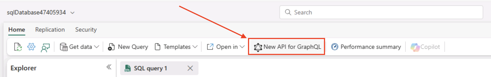
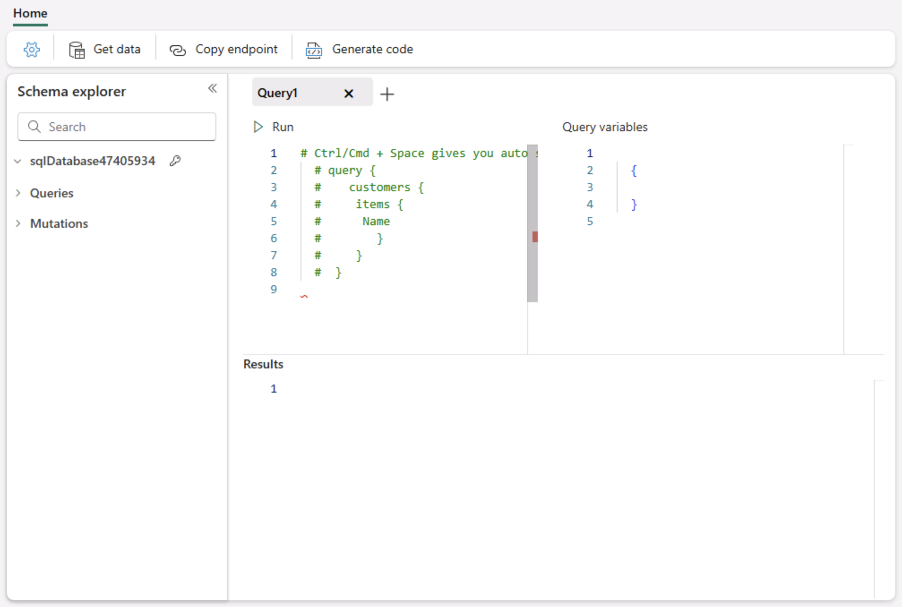
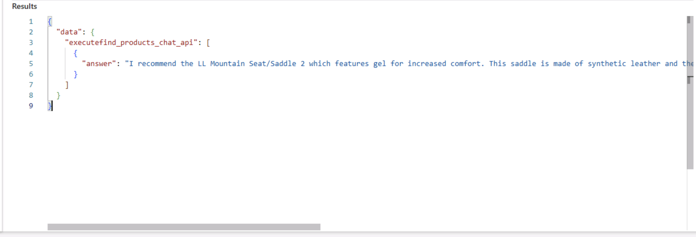

# Build a GraphQL API for RAG applications

In this section of the lab, you will be deploying a GraphQL API that uses embeddings, vector similarity search, and relational data to return a set of products that could be used by a chat application leveraging a Large Language Model (LLM).

In this section, we will create a stored procedure that will be used by the GraphQL API for taking in questions and returning products.

## Creating the stored procedure used by the GraphQL API

1. Run the following T-SQL in a new query window:

    ```SQL-notype
    CREATE or ALTER PROCEDURE [SalesLT].[find_products]
    @text nvarchar(max),
    @top int = 10,
    @min_similarity decimal(19,16) = 0.80
    as
    if (@text is null) return;
    DECLARE @retval int, @qv vector(1536);
    exec @retval = SalesLT.create_embeddings @text, @qv output;
    if (@retval != 0) return;
    with vector_results as (
    SELECT 
            p.Name as product_name,
            ISNULL(p.Color,'No Color') as product_color,
            c.Name as category_name,
            m.Name as model_name,
            d.Description as product_description,
            p.ListPrice as list_price,
            p.weight as product_weight,
            vector_distance('cosine', @qv, p.embeddings) AS distance
    FROM
        [SalesLT].[Product] p,
        [SalesLT].[ProductCategory] c,
        [SalesLT].[ProductModel] m,
        [SalesLT].[vProductAndDescription] d
    WHERE p.ProductID = d.ProductID
    AND p.ProductCategoryID = c.ProductCategoryID
    AND p.ProductModelID = m.ProductModelID
    AND p.ProductID = d.ProductID
    AND d.Culture = 'en')
    SELECT TOP(@top) product_name, product_color, category_name, model_name, product_description, list_price, product_weight, distance
    FROM vector_results
    WHERE (1-distance) > @min_similarity
    ORDER BY distance asc;
    GO
    ```

1. Next, you need to encapsulate the **STORED PROCEDURE** into a wrapper so that the result set can be utilized by our GraphQL endpoint. Using the **WITH RESULT SET** syntax allows you to change the names and data types of the returning result set. This is needed in this example because the usage of sp_invoke_external_rest_endpoint and the return output from extended stored procedures 

    Run the following T-SQL in a new query window:  

    ```SQL-notype
    CREATE or ALTER PROCEDURE SalesLT.[find_products_api]
        @text nvarchar(max)
        as 
        exec [SalesLT].find_products @text
        with RESULT SETS
        (    
            (    
                product_name NVARCHAR(200),    
                product_color NVARCHAR(50),    
                category_name NVARCHAR(50),    
                model_name NVARCHAR(50),    
                product_description NVARCHAR(max),    
                list_price INT,    
                product_weight INT,    
                distance float    
            )
        )
    GO
    ```

1. Let us test this newly created procedure to see the results by running the following SQL in a new query window:

    ```SQL-notype
    exec SalesLT.find_products_api 'I am looking for a red bike'
    ```
    

## Chat completion 
Let's alter the stored procedure to create a new flow that not only uses vector similarity search to get products based on a question asked by a user, but to take the results, pass them to Azure OpenAI Chat Completion, and craft an answer they would typically see with an AI chat application.

1. The first step in augmenting our RAG application API is to create a stored procedure that takes the retrieved products and passes them in a prompt to an Azure OpenAI Chat Completion REST endpoint. The prompt consists of telling the endpoint who they are, what products they have to work with, and the exact question that was asked by the user. 

    Copy and run the following SQL in a new query window:


```SQL-notype
    CREATE OR ALTER PROCEDURE [SalesLT].[prompt_answer]
    @user_question nvarchar(max),
    @products nvarchar(max),
    @answer nvarchar(max) output

    AS

    DECLARE @url nvarchar(4000) = '@lab.CloudResourceTemplate(Lab533Resources).Outputs[openAIEndpoint]openai/deployments/gpt-4/chat/completions?api-version=2024-06-01';
    DECLARE @payload nvarchar(max) = N'{
        "messages": [
            {
                "role": "system",
                "content": "You are a sales assistant who helps customers find the right products for their question and activities."
            },
            {
                "role": "user",
                "content": "The products available are the following: ' + @products + '"
            },
            {
                "role": "user",
                "content": " ' + @user_question + '"
            }
        ]
    }';

    DECLARE @ret int, @response nvarchar(max);

    exec @ret = sp_invoke_external_rest_endpoint
        @url = @url,
        @method = 'POST', 
        @payload = @payload,
        @credential = [@lab.CloudResourceTemplate(Lab533Resources).Outputs[openAIEndpoint]],    
        @timeout = 230,
        @response = @response output;

    select json_value(@response, '$.result.choices[0].message.content');

    GO

```

2. Now that you have created the chat completion stored procedure, we need to create a new find_products stored procedure that adds a call to this chat completion endpoint. This new stored procedure contains 2 additional steps that were not found in the original: 
    
    a) A section to help package up the results into something we can use in a prompt.
    
    ```SQL-nocopy
    STRING_AGG (CONVERT(NVARCHAR(max),CONCAT( 
                                    product_name, ' ' ,
                                    product_color, ' ',
                                    category_name, ' ', 
                                    model_name, ' ', 
                                    product_description )), CHAR(13)))   
    ```

    b) A section that calls the new chat completion stored procedure and provides it with the products retrieved from the database to help ground the answer.

    ```SQL-nocopy
    exec [SalesLT].[prompt_answer] @text, @products_json, @answer output;
    ```

3. Copy and run the following SQL in a new query window:


    ```SQL-notype
    CREATE or ALTER procedure [SalesLT].[find_products_chat]
    @text nvarchar(max),
    @top int = 3,
    @min_similarity decimal(19,16) = 0.70
    AS
    if (@text is null) return;
    DECLARE @retval int, @qv vector(1536), @products_json nvarchar(max), @answer nvarchar(max);
    exec @retval = SalesLT.create_embeddings @text, @qv output;
    if (@retval != 0) return;
    with vector_results as (
    SELECT 
            p.Name as product_name,
            ISNULL(p.Color,'No Color') as product_color,
            c.Name as category_name,
            m.Name as model_name,
            d.Description as product_description,
            p.ListPrice as list_price,
            p.weight as product_weight,
            vector_distance('cosine', @qv, p.embeddings) AS distance
    FROM
        [SalesLT].[Product] p,
        [SalesLT].[ProductCategory] c,
        [SalesLT].[ProductModel] m,
        [SalesLT].[vProductAndDescription] d
    WHERE p.ProductID = d.ProductID
    AND p.ProductCategoryID = c.ProductCategoryID
    AND p.ProductModelID = m.ProductModelID
    AND p.ProductID = d.ProductID
    AND d.Culture = 'en')
    select
    top(@top)
    @products_json = (STRING_AGG (CONVERT(NVARCHAR(max),CONCAT( 
                                    product_name, ' ' ,
                                    product_color, ' ',
                                    category_name, ' ', 
                                    model_name, ' ', 
                                    product_description, ' ',
                                    list_price, ' ',
                                    product_weight )), CHAR(13)))
    FROM vector_results
    WHERE (1-distance) > @min_similarity
    GROUP BY  distance
    ORDER BY    
        distance asc;

    SET @products_json = (select REPLACE(REPLACE(@products_json, CHAR(13), ' , '), CHAR(10), ' , '));

    exec [SalesLT].[prompt_answer] @text, @products_json, @answer output;

    GO
    ```

4. The last step before we can create a **GraphQL** endpoint is to wrap the new find products stored procedure.

Copy and run the following SQL in a new query window.

```SQL
 CREATE or ALTER Procedure SalesLT.[find_products_chat_api]
        @text nvarchar(max)
        AS 
        exec SalesLT.find_products_chat @text
        with RESULT SETS
        (    
            (    
                answer NVARCHAR(max)
            )
        )
    GO
```

5. You can test this new  procedure to see how Azure OpenAI will answer a question with product data by running the following SQL in a blank query editor in Microsoft Fabric:

    ```SQL-notype
    exec SalesLT.find_products_chat_api 'I am looking for a red bike'
    ```
> [!TIP]
>
> Above execution will result in this answer: **"It sounds like the Road-650 Red, 62 Red Road Bikes Road-650 would be an excellent choice for you. This value-priced bike comes in red and features a light, stiff frame that is known for its quick acceleration. It also incorporates many features from top-of-the-line models. Would you like more details about this bike or help with anything else?"** . Note: Your answer could be different.
    
  
## Create GraphQL API

1. To create the GraphQL API, click on the **New API for GraphQL** button on the toolbar just as you did previously.
    
   

1. In the **New API for GraphQL** dialog box, use the **Name Field** and name the API **find_products_chat_api**.
After naming the API, click the **green Create button**.
    
  

1.  In the next dialog box use the **Search box** in the **Explorer section** on the left and enter in **find_products_chat_api**.
    
   

1. Choose the stored procedure in the results. You can ensure it is the **find_products_chat_api** stored procedure by hovering over it with your mouse/pointer. It will also indicate the selected database item in the preview section. It should state **"Preview data: SalesLT.find_products_chat_api"**.
    
    

Once you have selected the **find_products_chat_api stored procedure**, click the **green Load button** on the bottom right of the modal dialog box.
   

1. You will now be on the **GraphQL Query editor page**.
    
   

1. Copy/Paste the below code in the GraphQL query editor.

    ```graphql-notype
    query {
        executefind_products_chat_api(text: "I am looking for padded seats that are good on trails") {
                answer
        }
    }
    ```

    
   
1. Now, **click the Run button** in the upper left of the GraphQL query editor.
    
     

1. And you can review the response in the **Results** section of the editor
    
    

1. Copy the following code in the the GraphQL editor and see what answer the chat completion endpoint provides!

    ```graphql-notype
    query {
        executefind_products_chat_api(text: "Do you have any racing shorts?") {
                answer
        }
    }
    ```


The API you just created could now be handed off to an application developer to be included in a RAG application that uses vector similarity search and data from the database.

Here is a fully functioning Chat application for you to try
[Chat App](https://fabcon-euro.azurewebsites.net/)

Congratulations!! In this module, you  learned how to build a RAG application using SQL database in fabric, and Azure OpenAI. You explored generating vector embeddings for relational data, performing semantic similarity searches with SQL, and integrating natural language responses via GPT-4.0.
