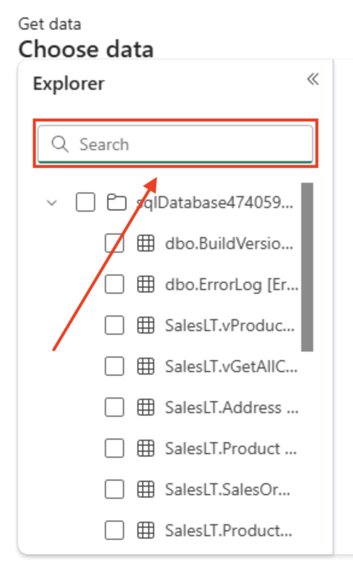
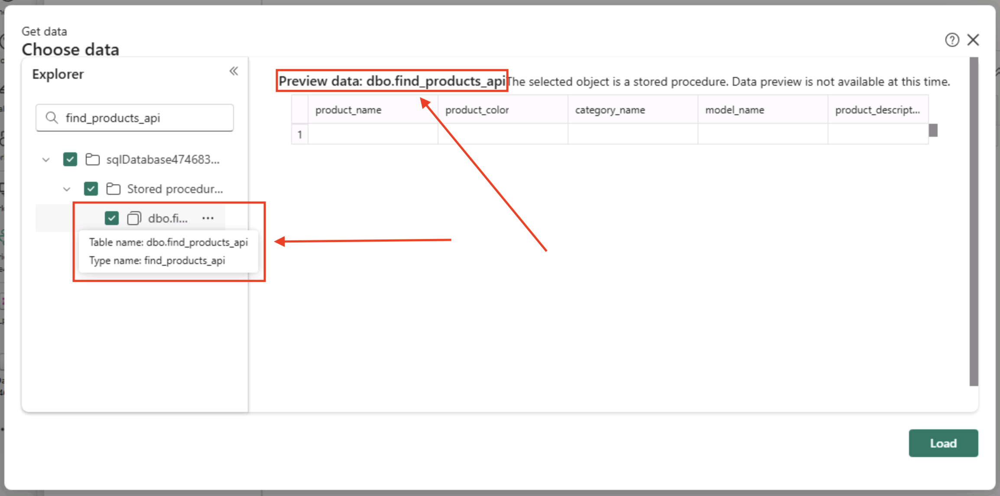
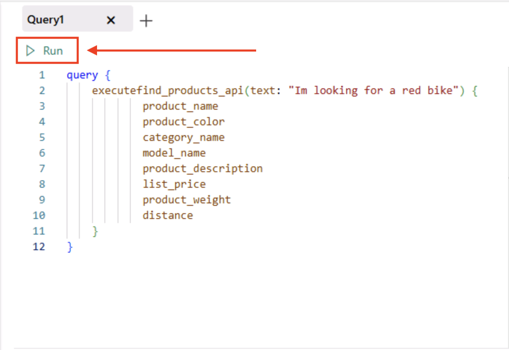
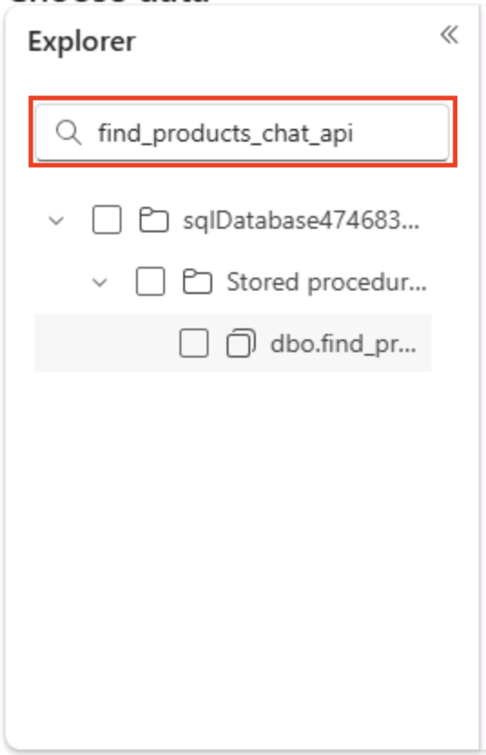

# Build a GraphQL API for RAG applications

In this section of the lab, you will be deploying a GraphQL API that uses embeddings, vector similarity search, and relational data to return a set of Adventure Works products that could be used by a chat application leveraging a Large Language Model (LLM). In essence, putting all the pieces together in the previous sections.

In the section of the lab, you will create a stored procedure that will be used by the GraphQL API for taking in questions and returning products.

## Creating the stored procedure used by the GraphQL API

1. Run the following SQL in a blank query editor in Microsoft Fabric:

    ```SQL-notype
    create or alter procedure [dbo].[find_products]
    @text nvarchar(max),
    @top int = 10,
    @min_similarity decimal(19,16) = 0.80
    as
    if (@text is null) return;
    DECLARE @retval int, @qv vector(1536);
    exec @retval = dbo.create_embeddings @text, @qv output;
    if (@retval != 0) return;
    with vector_results as (
    SELECT 
            p.Name as product_name,
            ISNULL(p.Color,'No Color') as product_color,
            c.Name as category_name,
            m.Name as model_name,
            d.Description as product_description,
            p.ListPrice as list_price,
            p.weight as product_weight,
            vector_distance('cosine', @qv, p.embeddings) AS distance
    FROM
        [SalesLT].[Product] p,
        [SalesLT].[ProductCategory] c,
        [SalesLT].[ProductModel] m,
        [SalesLT].[vProductAndDescription] d
    where p.ProductID = d.ProductID
    and p.ProductCategoryID = c.ProductCategoryID
    and p.ProductModelID = m.ProductModelID
    and p.ProductID = d.ProductID
    and d.Culture = 'en')
    select TOP(@top) product_name, product_color, category_name, model_name, product_description, list_price, product_weight, distance
    from vector_results
    where (1-distance) > @min_similarity
    order by    
        distance asc;
    GO
    ```

1. Next, you need to encapsulate the stored procedure into a wrapper so that the result set can be utilized by our GraphQL endpoint. Using the WITH RESULT SET syntax allows you to change the names and data types of the returning result set. This is needed in this example because the usage of sp_invoke_external_rest_endpoint and the return output from extended stored procedures 

    Run the following SQL in a blank query editor in Microsoft Fabric:  

    ```SQL-notype
    create or alter procedure [find_products_api]
        @text nvarchar(max)
        as 
        exec find_products @text
        with RESULT SETS
        (    
            (    
                product_name NVARCHAR(200),    
                product_color NVARCHAR(50),    
                category_name NVARCHAR(50),    
                model_name NVARCHAR(50),    
                product_description NVARCHAR(max),    
                list_price INT,    
                product_weight INT,    
                distance float    
            )
        )
    GO
    ```

1. You can test this newly created procedure to see how it will interact with the GraphQL API by running the following SQL in a blank query editor in Microsoft Fabric:

    ```SQL-notype
    exec find_products_api 'I am looking for a red bike'
    ```
    
   
1. To create the GraphQL API, click on the **New API for GraphQL** button on the toolbar.

    

1. In the **New API for GraphQL** dialog box, use the **Name Field** and name the API **find_products_api**.

    
    

1. After naming the API, click the **green Create button**.
    
    

1.  The next dialog box presented is the **Choose data** dialog box where you will pick a table or stored procedure for the GraphQL API, 

    
   

    use the **Search box** in the **Explorer section** on the left 
    
    
   

    and **enter in find_products_api**.

    
   

1. Choose the **find_products_api stored procedure in the results**. You can ensure it is the find_products_api stored procedure by hovering over it with your mouse/pointer. It will also indicate the selected database item in the preview section. It should state **"Preview data: dbo.find_products_api"**.

    
   

1. Once you have selected the **find_products_api stored procedure**, click the **green Load button** on the bottom right of the modal dialog box.

    
    

1. You will now be on the **GraphQL Query editor page**. Here, we can run GraphQL queries similar to how we can run T-SQL queries on the query editor.
    
    

1. Replace the sample code on the left side of the GraphQL query editor with the following query:

    ```graphql-notype
    query {
        executefind_products_api(text: "I am looking for a red bike") {
                product_name
                product_color
                category_name
                model_name
                product_description
                list_price
                product_weight
                distance 
        }
    }
    ```
    
    

1. Now, click the **Run button** in the upper left of the GraphQL query editor. 

    
   

    and you can scroll through the results from the GraphQL query in the lower section of the editor.
    
    
1. Back on the toolbar, find and click the **Generate code button**.
    
    

1. This feature will generate the code for calling this API via python or node.js to help give you a jumpstart in the application creation process.
    
   

1. When done looking_the python and node.js code, click the **X** in the upper right corner to close the Generate code dialog box.
    
   

## Adding chat completion to the GraphQL API

The API you just created could now be handed off to an application developer to be included in a RAG application that uses vector similarity search and data from the database. The application may also_some point hand the results off to a LLM to craft a more human response. 

Let's alter the stored procedure to create a new flow that not only uses vector similarity search to get products based on a question asked by a user, but to take the results, pass them to Azure OpenAI Chat Completion, and craft an answer they would typically see with an AI chat application.

1. Before we can start creating new stored procedures, we need to go back to the SQL Database in fabric in fabric home page. Do this by using the navigator on the left side of the page and clicking on the SQL Database icon.
    
   

1. The first step in augmenting our RAG application API is to create a stored procedure that takes the retrieved products and passes them in a prompt to an Azure OpenAI Chat Completion REST endpoint. The prompt consists of telling the endpoint who they are, what products they have to work with, and the exact question that was asked by the user. 

    Copy and run the following SQL in a blank query editor in Microsoft Fabric:

<!--- > **Note:** Replace ``AI_ENDPOINT_SERVERNAME`` with the name of your **Azure OpenAI** service. --->


```SQL-notype
    CREATE OR ALTER PROCEDURE [dbo].[prompt_answer]
    @user_question nvarchar(max),
    @products nvarchar(max),
    @answer nvarchar(max) output

    AS

    DECLARE @url nvarchar(4000) = N'`@lab.CloudResourceTemplate(Lab533Resources).Outputs[openAIEndpoint]`/openai/deployments/gpt-4.1/chat/completions?api-version=2024-06-01';
    DECLARE @payload nvarchar(max) = N'{
        "messages": [
            {
                "role": "system",
                "content": "You are a sales assistant who helps customers find the right products for their question and activities."
            },
            {
                "role": "user",
                "content": "The products available are the following: ' + @products + '"
            },
            {
                "role": "user",
                "content": " ' + @user_question + '"
            }
        ]
    }';

    DECLARE @ret int, @response nvarchar(max);

    exec @ret = sp_invoke_external_rest_endpoint
        @url = @url,
        @method = 'POST', 
        @payload = @payload,
        @credential = [`@lab.CloudResourceTemplate(Lab533Resources).Outputs[openAIEndpoint]`],    
        @timeout = 230,
        @response = @response output;

    select json_value(@response, '$.result.choices[0].message.content');

    GO

```

1. Now that you have created the chat completion stored procedure, we need to create a new find_products stored procedure that adds a call to this chat completion endpoint. This new stored procedure contains 2 additional steps that were not found in the original: 
    
    1) A section to help package up the results into something we can use in a prompt.
    
    ```SQL-nocopy
    STRING_AGG (CONVERT(NVARCHAR(max),CONCAT( 
                                    product_name, ' ' ,
                                    product_color, ' ',
                                    category_name, ' ', 
                                    model_name, ' ', 
                                    product_description )), CHAR(13)))   
    ```

    2) A section that calls the new chat completion stored procedure and provides it with the products retrieved from the database to help ground the answer.

    ```SQL-nocopy
    exec [dbo].[prompt_answer] @text, @products_json, @answer output;
    ```

1. Copy and run the following SQL in a blank query editor in Microsoft Fabric:


    ```SQL-notype
    create or alter procedure [dbo].[find_products_chat]
    @text nvarchar(max),
    @top int = 3,
    @min_similarity decimal(19,16) = 0.70
    as
    if (@text is null) return;
    DECLARE @retval int, @qv vector(1536), @products_json nvarchar(max), @answer nvarchar(max);
    exec @retval = dbo.create_embeddings @text, @qv output;
    if (@retval != 0) return;
    with vector_results as (
    SELECT 
            p.Name as product_name,
            ISNULL(p.Color,'No Color') as product_color,
            c.Name as category_name,
            m.Name as model_name,
            d.Description as product_description,
            p.ListPrice as list_price,
            p.weight as product_weight,
            vector_distance('cosine', @qv, p.embeddings) AS distance
    FROM
        [SalesLT].[Product] p,
        [SalesLT].[ProductCategory] c,
        [SalesLT].[ProductModel] m,
        [SalesLT].[vProductAndDescription] d
    where p.ProductID = d.ProductID
    and p.ProductCategoryID = c.ProductCategoryID
    and p.ProductModelID = m.ProductModelID
    and p.ProductID = d.ProductID
    and d.Culture = 'en')
    select
    top(@top)
    @products_json = (STRING_AGG (CONVERT(NVARCHAR(max),CONCAT( 
                                    product_name, ' ' ,
                                    product_color, ' ',
                                    category_name, ' ', 
                                    model_name, ' ', 
                                    product_description, ' ',
                                    list_price, ' ',
                                    product_weight )), CHAR(13)))
    from vector_results
    where (1-distance) > @min_similarity
    group by distance
    order by    
        distance asc;

    set @products_json = (select REPLACE(REPLACE(@products_json, CHAR(13), ' , '), CHAR(10), ' , '));

    exec [dbo].[prompt_answer] @text, @products_json, @answer output;

    GO
    ```

1. The last step before we can create a new GraphQL endpoint is to wrap the new find products stored procedure. Copy and run the following SQL in a blank query editor in Microsoft Fabric:


    ```SQL-notype
    create or alter procedure [find_products_chat_api]
        @text nvarchar(max)
        as 
        exec find_products_chat @text
        with RESULT SETS
        (    
            (    
                answer NVARCHAR(max)
            )
        )
    GO
    ```

1. You can test this new  procedure to see how Azure OpenAI will answer a question with product data by running the following SQL in a blank query editor in Microsoft Fabric:

    ```SQL-notype
    exec find_products_chat_api 'I am looking for a red bike'
    ```

    with the answer being similar to (your answer will be different): **"It sounds like the Road-650 Red, 62 Red Road Bikes Road-650 would be an excellent choice for you. This value-priced bike comes in red and features a light, stiff frame that is known for its quick acceleration. It also incorporates many features from top-of-the-line models. Would you like more details about this bike or help with anything else?"**
    
  

1. To create the GraphQL API, click on the **New API for GraphQL** button on the toolbar just as you did previously.
    
   

1. In the **New API for GraphQL** dialog box, use the **Name Field** and name the API **find_products_chat_api**.
    
   

1. After naming the API, click the **green Create button**.
    
  

1.  The next dialog box presented is again the **Choose data** dialog box where you will pick a table or stored procedure for the GraphQL API, 
    
   

    use the **Search box** in the **Explorer section** on the left 
    
   

    and **enter in find_products_chat_api**.
    
   

1. Choose the stored procedure in the results. You can ensure it is the **find_products_chat_api stored procedure** by hovering over it with your mouse/pointer. It will also indicate the selected database item in the preview section. It should state **"Preview data: dbo.find_products_chat_api"**.
    
    

1. Once you have selected the **find_products_chat_api stored procedure**, click the **green Load button** on the bottom right of the modal dialog box.

    
   

1. You will now be back on the **GraphQL Query editor page**.
    
   

1. Replace the sample code on the left side of the GraphQL query editor with the following query:

    ```graphql-notype
    query {
        executefind_products_chat_api(text: "I am looking for padded seats that are good on trails") {
                answer
        }
    }
    ```

    
   
1. Now, **click the Run button** in the upper left of the GraphQL query editor.
    
     

1. And you can review the response in the **Results** section of the editor
    
    

1. Try it again with the following code and see what answer the chat completion endpoint provides!

    ```graphql-notype
    query {
        executefind_products_chat_api(text: "Do you have any racing shorts?") {
                answer
        }
    }
    ```
In this module, you would have learned how to build a RAG application using SQL database in fabric, and Azure OpenAI. You explored generating vector embeddings for relational data, performing semantic similarity searches with SQL, and integrating natural language responses via GPT-4.1.
