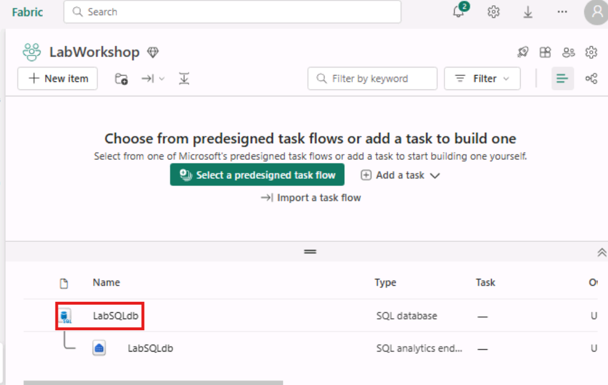
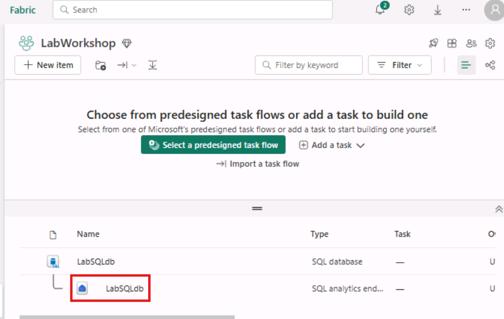
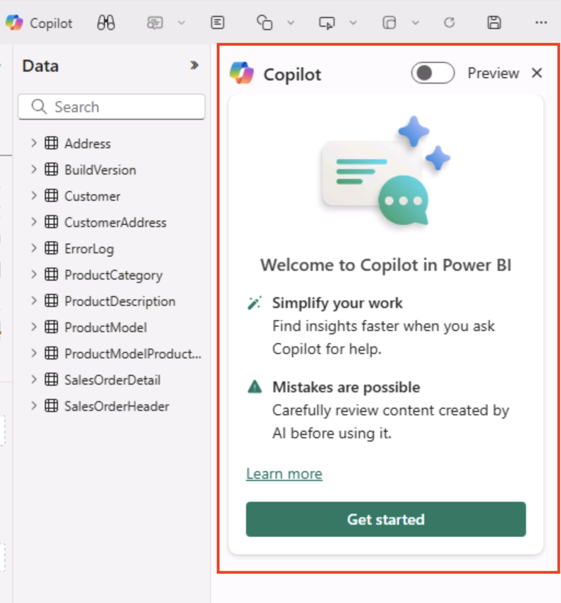
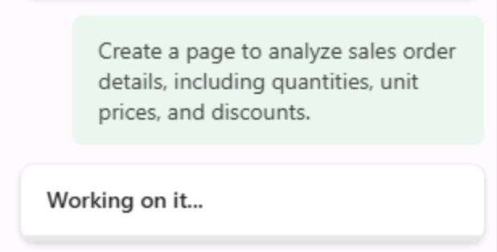

# 5. Creating a Power BI Report from a SQL analytics endpoint in Microsoft Fabric with Copilot

It's easy to quickly create reports in Power BI with SQL analytics endpoint in Fabric using Copilot. 

## Build a new report with Copilot
1. Open the SQL database you created in the first module.

1. Now on the database details page, find the **SQL database dropdown** in the upper right side of the page.
    
    

1. Click the SQL database dropdown and select **SQL analytics endpoint**.
    
   

    > [!IMPORTANT] 
    >
    >You can also get to the SQL analytics endpoint by clicking on your workspace tile, and selecting the SQL analytics endpoint.
    
    
   

1. On the SQL database analytics endpoint details page, **click the New semantic model** from the ribbon.
    
   

1. When the **New semantic model** window opens, enter the name **product_insight**, complete the **workspace details**, and click **select all** tables to create the semantic model.
   
  
1. Now search the newly created **semantic model - product_insight** in the search bar.
	
   

1. Go to **explore new data** and **Create blank report**.
   

1. Click on **Copilot**.  On the **right side** of the page, the **Copilot blade** opens.

    
  

1. Click the **green Get started button**.
    
  

1. Copilot presents some questions to get you started. Click **Suggest content for a new report page**.
    
    

1. Suggested outlines for your report are returned by Copilot based on the data it has access to in the analytics endpoint. 

    > [!IMPORTANT]
    >
    > The suggested reports returned by Copilot may differ from the following images.
    
   
1. You can review the selections by **expanding their cards** to see a quick description about the report.

1. Click the **Create button** for the **Geographic sales distribution** report **or any other report** you would like to create. Go wild!

1. Copilot will then begin **creating your report**.

    
   

1. You now have a Power BI report of your SQL database data!
    
  

